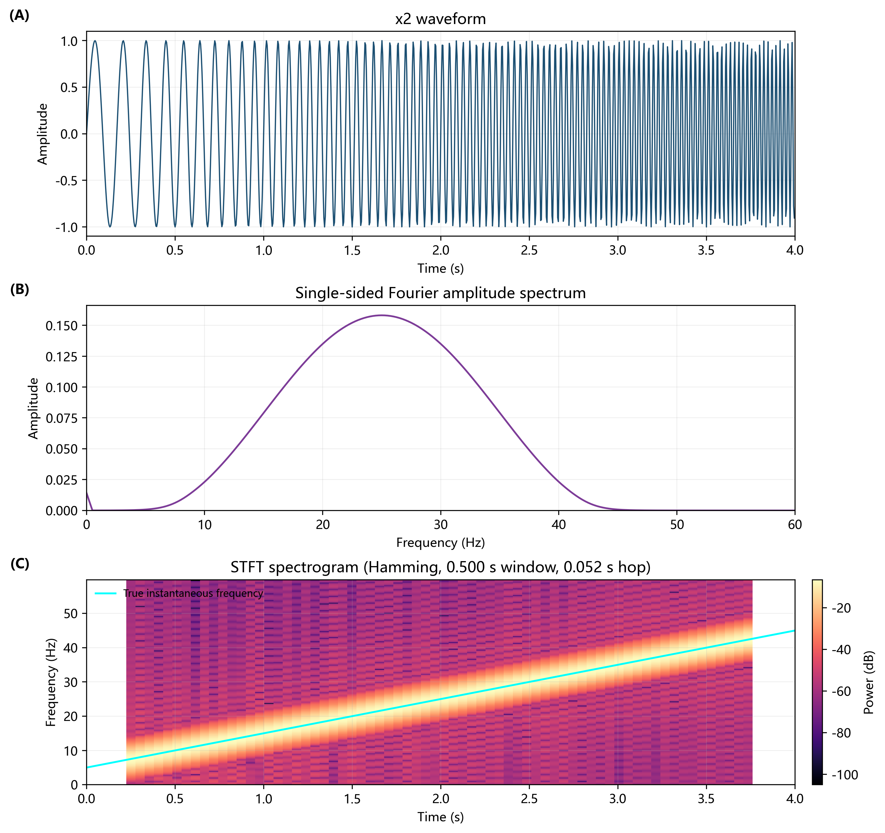
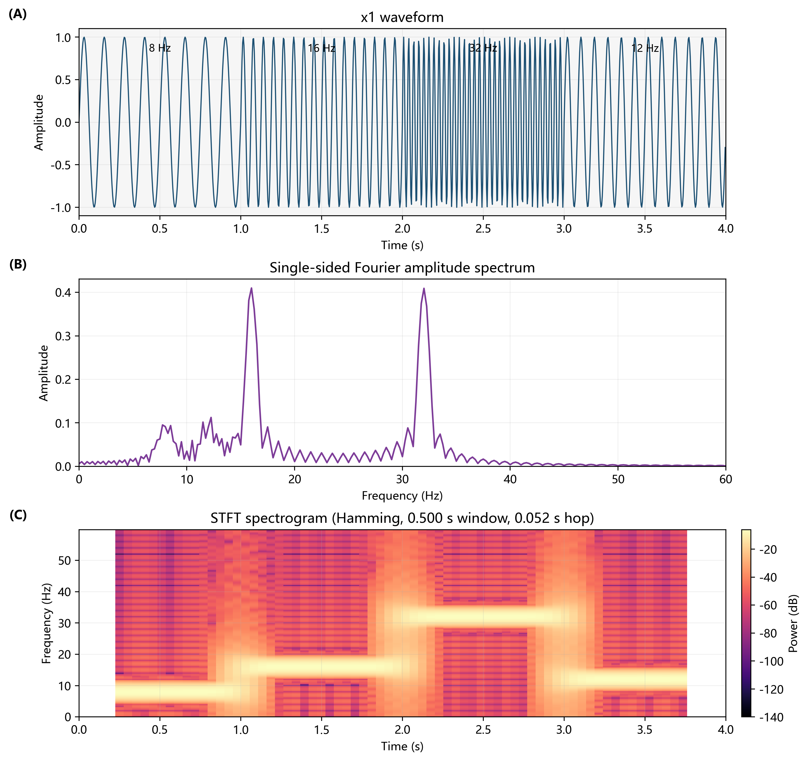
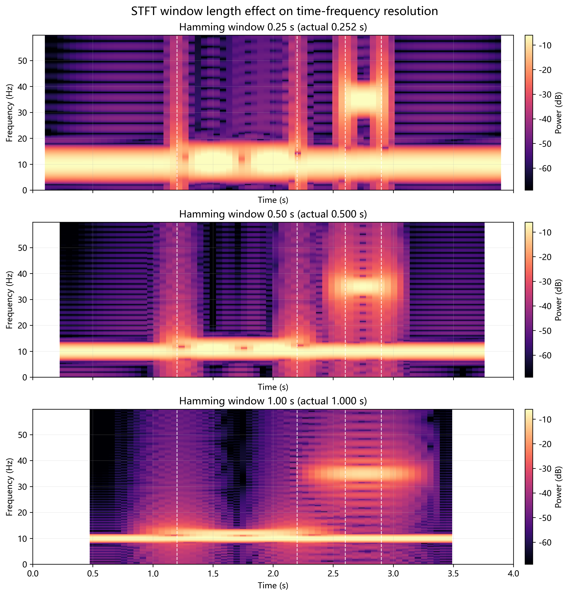
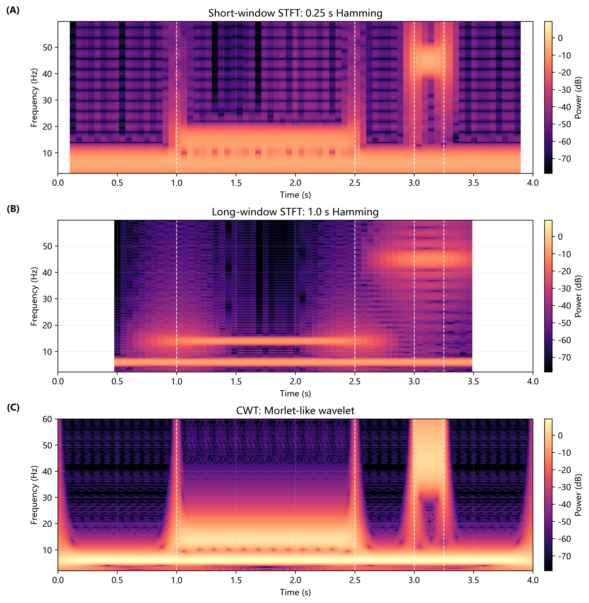
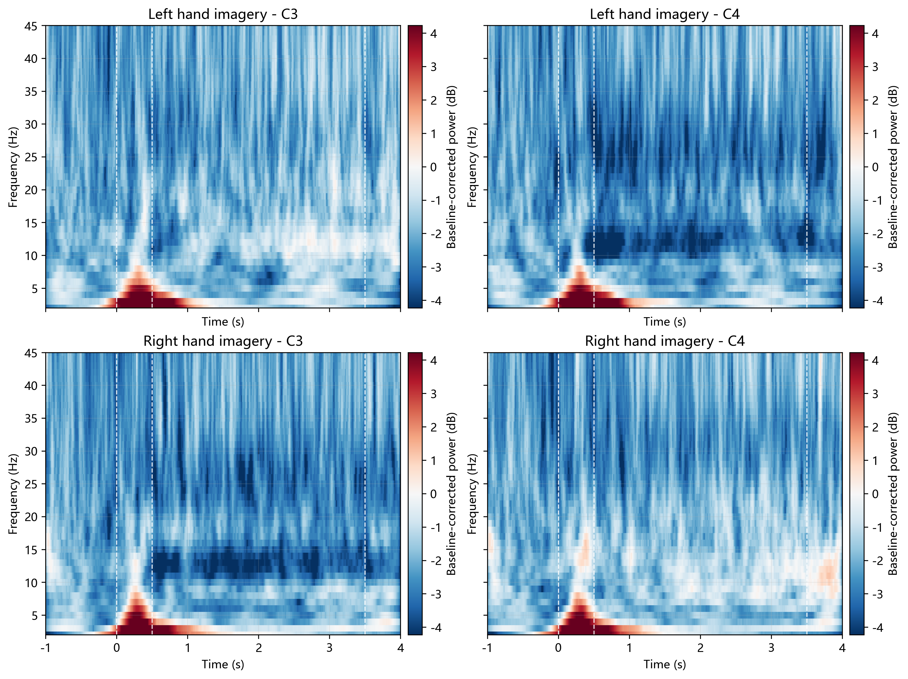
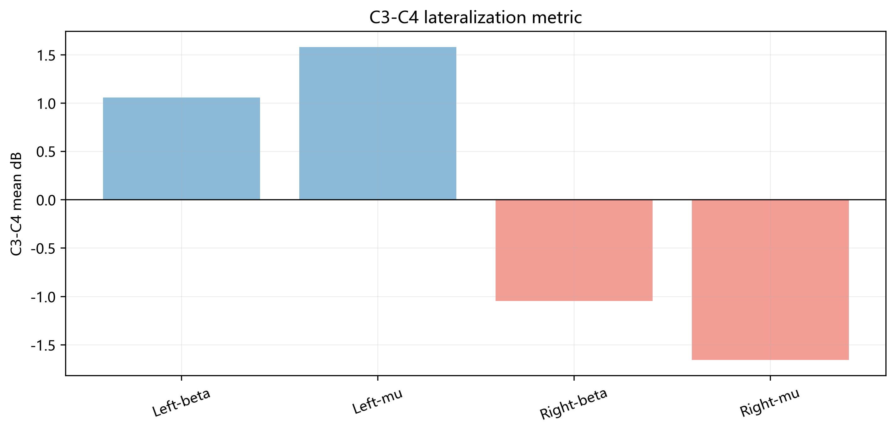

# Time-Frequency Analysis for Nonstationary Signals and Motor Imagery EEG

This repository contains a reproducible Python workflow for a medical signal processing experiment on Fourier analysis, short-time Fourier transform (STFT), continuous wavelet transform (CWT), wavelet multiresolution analysis, and OpenBMI motor imagery EEG ERD analysis.

The public version includes source code, derived metrics, English figures, and the English PDF report. The raw teaching dataset is not committed because the `.mat` file is large; see [data/README.md](data/README.md) for the expected local placement.

## Reports

- [English PDF report](Experiment_3_Time_Frequency_Analysis_Report_EN.pdf)
- [English LaTeX source](report/main_en.tex)

## Project Overview

The experiment is organized into four connected parts:

1. Artificial nonstationary signals: compare full-record Fourier spectra with STFT.
2. STFT parameter study: quantify how window length and window function affect time and frequency resolution.
3. CWT and wavelet multiresolution: compare fixed-window STFT with Morlet-like CWT and DWT layer reconstruction.
4. Real motor imagery EEG: estimate baseline-corrected mu/beta ERD and C3/C4 lateralization from OpenBMI data.



## Key Results

### STFT Reveals Timing That Fourier Spectra Lose

The full Fourier spectrum can show that a signal contains several frequencies, but it cannot state when each frequency occurs. STFT adds a sliding window and turns local spectra into a time-frequency map.



### STFT Parameters Encode a Real Tradeoff

Short windows localize transient bursts better, while long windows separate nearby low-frequency components better. Window functions also affect leakage and the apparent width of time-frequency energy.



### CWT Provides Frequency-Dependent Resolution

CWT uses different scales at different frequencies. In the artificial multiscale signal, it preserves a continuous low-frequency band while still localizing the high-frequency burst more effectively than a single fixed STFT setting.



### Motor Imagery EEG Shows Contralateral ERD Lateralization

The EEG analysis computes CWT power per trial, applies pre-cue baseline dB correction, and then averages by condition. The C3-C4 lateralization metric is positive for left-hand imagery and negative for right-hand imagery, matching the expected contralateral ERD pattern.





## Repository Structure

```text
scripts/
  experiment1.py              # Artificial piecewise/chirp signal analysis
  experiment2.py              # STFT window length and window function study
  experiment3.py              # CWT and DWT multiresolution analysis
  experiment4_eeg.py          # OpenBMI motor imagery EEG ERD analysis
  english_figures.py          # English figure regeneration
  report_writer_en.py         # English LaTeX report generator
  build_report_en.py          # English PDF compiler
  run_all_public.py           # End-to-end public workflow
results/
  tables/                     # Derived CSV metrics
  data/                       # JSON summaries and ridge data
results_en/
  figures/                    # English figures used by the public report
report/
  main_en.tex                 # English report source
data/
  README.md                   # Raw dataset placement instructions
```

## Reproduction

Create and install the Python environment:

```powershell
python -m venv .venv
.venv\Scripts\python -m pip install -r requirements.txt
```

Place the teaching dataset as described in [data/README.md](data/README.md), then run:

```powershell
.venv\Scripts\python scripts\run_all_public.py
```

This regenerates experiment outputs, English figures, the English LaTeX source, and the English PDF report.

To rebuild only the English report after text edits:

```powershell
.venv\Scripts\python scripts\english_figures.py
.venv\Scripts\python scripts\report_writer_en.py
.venv\Scripts\python scripts\build_report_en.py
```

## Notes on Data and Privacy

The public repository excludes the raw `.mat` EEG dataset and private Chinese submission artifacts. It includes derived tables and figures needed to inspect the reported results. Re-running the full EEG computation requires the original teaching dataset to be available locally.
